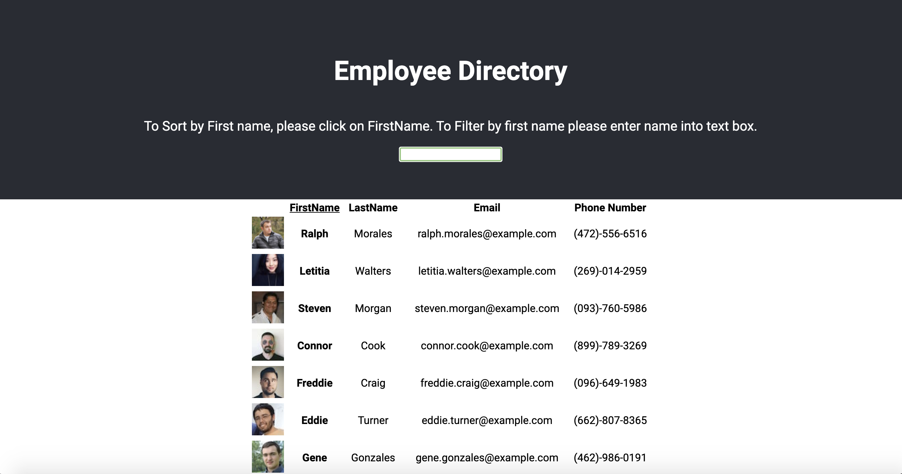

# Employee Directory
[](https://opensource.org/licenses/MIT)
## Table of contents
1. [Description](#description)
2. [Installation](#installation)
3. [Usage](#usage)
4. [Contributing](#contributing)
5. [License](#license)
6. [Screenshot](#screenshot)
7. [Questions](#questions)
    
<a name="descriptipn"></a>
## Description
This is an an employee directory made with React. This application will allow you to sort employees by first name as well as do a filter search for employees by first name
    
<a name="installation"></a>
## Installation
Clone this repo down and cd into employee-directory ```cd employee-directory``` once inside the directory run ```npm install``` to install all the necessary dependencies. then run ```npm run start``` to start the application
    
<a name="usage"></a>
## Usage
Begin by typing in the a name into the input box, directory will automactically update and filter out results. to sort by first name, click on first name field
    
<a name="contributing"></a>
## Contributing
This project is open source so feel free to make it your own
    
<a name="license"></a>
## License
[](https://opensource.org/licenses/MIT)
<a name="screenshot"></a>
## Screenshot

    
<a name="questions"></a>
## Questions
Feel free to check out my [GitHub](www.github.com/pattymcpat) repository. Also feel free to send me an email at <patrickly72@gmail.com> if you have any questions

<a name="links"></a>
## Links
1. Deployed 
https://pattymcpat.github.io/employee-directory/
2. Repo
https://github.com/pattymcpat/employee-directory
3. Linked in
https://www.linkedin.com/in/patrick-ly-aa280717a/